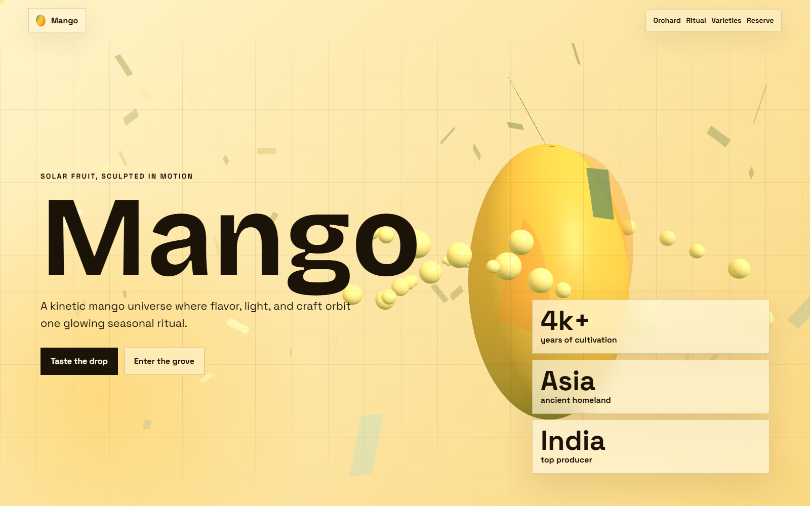

# Mango

A cinematic mango website with a custom Three.js fruit scene, scroll animation, mango history, geography, production countries, and interactive flavor cards.



## Project Structure

```text
Mango/
  index.html
  package.json
  README.md
  assets/
    .gitkeep
    mango-preview.png
  scripts/
    dev-server.js
  src/
    js/
      config.js
      interactions.js
      main.js
      scene.js
    styles/
      animations.css
      base.css
      components.css
      layout.css
      main.css
      responsive.css
      tokens.css
```

## Styling Details

The website uses a bright mango-inspired visual system built from warm yellows, deep orange, leafy green, and dark ink text. The main color tokens live in `src/styles/tokens.css`, making the palette easy to adjust without hunting through every file.

The page background is layered with radial and linear gradients to create a sunlit tropical feeling. A subtle fixed grid is added with `body::before`, which gives the site a modern editorial/interactive look instead of a plain flat background.

The layout is handled in `src/styles/layout.css`. Each major section uses full-screen panels, large spacing, and responsive CSS grid layouts. The hero section places the main mango story on the left and the animated 3D mango/fact cards on the right, creating a cinematic split composition.

Reusable UI styling lives in `src/styles/components.css`. This includes the glass-like navigation, mango logo mark, CTA buttons, fact cards, story cards, country cards, variety buttons, form styling, floating grain layer, and custom cursor glow. The cards use translucent backgrounds, blur, borders, and soft shadows to keep the interface readable while still letting the 3D scene show through.

Motion styling is separated into `src/styles/animations.css`. Scroll reveal effects fade content upward as sections enter the viewport, while the mango slice stack uses a continuous floating animation. A reduced-motion media query is included so users who prefer less animation still get a comfortable experience.

Responsive rules are in `src/styles/responsive.css`. The desktop grid collapses into single-column layouts on tablets and phones, the navigation stacks neatly on small screens, and the large hero typography scales down so the design remains usable on mobile.

The 3D styling is powered by Three.js in `src/js/scene.js`. The mango is built from layered geometry, custom material colors, a leaf shape, lighting, orbiting nectar particles, and drifting petal shapes. It responds to pointer movement, scroll position, and the selected mango variety tone.

## Run Locally

Because this site uses JavaScript modules, serve it from the included Node.js server:

```bash
npm start
```

Then open:

```text
http://localhost:4173/
```

## Deploy

This is a static site, so it can be deployed directly to GitHub Pages, Netlify, Vercel, or any static hosting service.

For GitHub Pages, publish the repository root and keep `index.html` at the top level.

## Credits

The 3D mango, nectar particles, and visual effects are built with Three.js through an import map in `index.html`.
